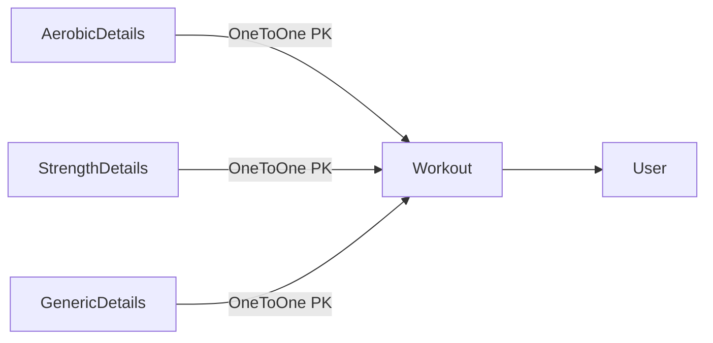
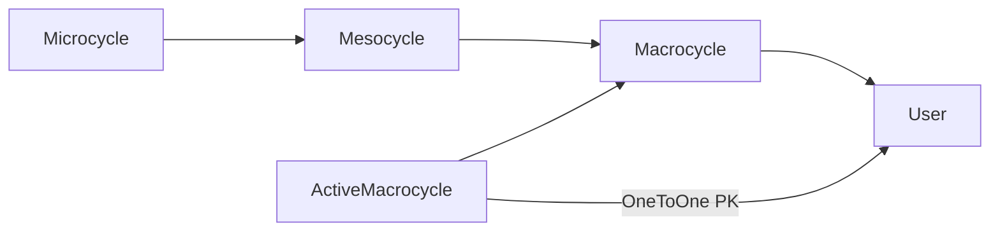

# Database diagrams

## Workout & Detail Models

**User** (custom, extends `AbstractUser`): email (unique, required), `weekly_upload_count`, `weekly_upload_reset` (for the 5000-workout/week upload cap, resets Monday).

**Workout**: user, name, start_time, description, workout_status (planned / completed / cancelled / postponed), subtype. Subtype is the stored field (running, cycling, swimming, skiing, walking, strength, mobility); `workout_type` (aerobic / strength / generic) is a computed property derived from `SUBTYPE_TYPE_MAP`.

**Detail models** — all inherit abstract `DetailBase` (shared fields: `duration`, `additional_data` JSON):

- **AerobicDetails**: distance (meters; `distance_km`, `speed`, `pace`, `pace_display` are computed properties)
- **StrengthDetails**: num_sets, total_weight (kg)
- **GenericDetails**: no extra fields

Dynamic per-subtype fields (HR, cadence, power, elevation, training load, time-in-zone, etc.) are stored under `additional_data["gui_fields"]` and validated against each subtype's `GUI_SCHEMAS` entry.

*Detail models are optional — a workout without a detail record has no recorded data yet.*

---

## Periodization Models

**Macrocycle**: user, name (unique per user), start_date, description, primary_sport (aerobic subtype — determines which workouts count as primary sessions vs cross-training in the summary view). `end_date` and `scheduled_duration` are computed via `hydrate()`.

**Mesocycle**: macrocycle FK, `order` (auto-managed, gap-free via `OrderMixin`), meso_type (base / prep / build / sharpen / specific / peak / transition), comment. `start_date`, `end_date`, `duration_days` are computed via `Macrocycle.hydrate()`.

**Microcycle**: mesocycle FK, `order` (auto-managed, gap-free), `duration_days` (default 7 — **the single source of truth** for all date computation), micro_type (intro / load / overload / consolidate / deload / taper / race), comment, planned_sessions, planned_distance, planned_long_distance, planned_strength_sessions, planned_cross_sessions. `start_date` / `end_date` are computed via `Macrocycle.hydrate()`.

**ActiveMacrocycle**: one-per-user mapping (user is OneToOne PK) → currently active macrocycle. Drives the home-page redirect to the active plan's summary.

*Cascade delete: removing a Macrocycle removes all its Mesocycles and their Microcycles. Deleting the User removes their Macrocycles, Workouts, and ActiveMacrocycle row.*
