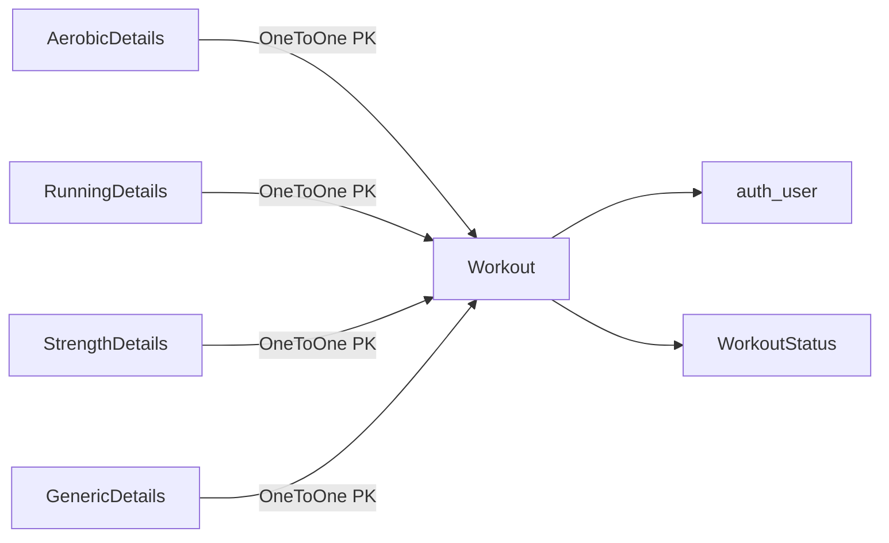

# Database diagrams

## Workout & Detail Models

**Workout**: user, name, start_time, description, workout_type (aerobic / running / strength / generic), workout_status

**Detail models** (all share: duration, avg_hr, max_hr, additional_data):
- **AerobicDetails**: distance, cadence, speed (computed)
- **RunningDetails**: distance, cadence, speed, z1–z5 seconds
- **StrengthDetails**: num_sets, total_weight
- **GenericDetails**: no extra fields

*Detail models are optional — a workout without a detail record has no recorded data yet.*

---

## Periodization Models

**Macrocycle**: name, start_date, end_date, description

**Mesocycle**: macrocycle FK, meso_type (base / prep / build / sharpen / specific / peak / transition), start_date, end_date, description

**Microcycle**: mesocycle FK, micro_type (intro / load / overload / consolidate / deload / taper / race), start_date, end_date, description, goal_run_sessions, goal_dst_m, goal_long_run_dst_m, goal_strength_sessions, goal_cross_sessions

*Cascade delete: removing a Macrocycle removes all its Mesocycles and their Microcycles.*
